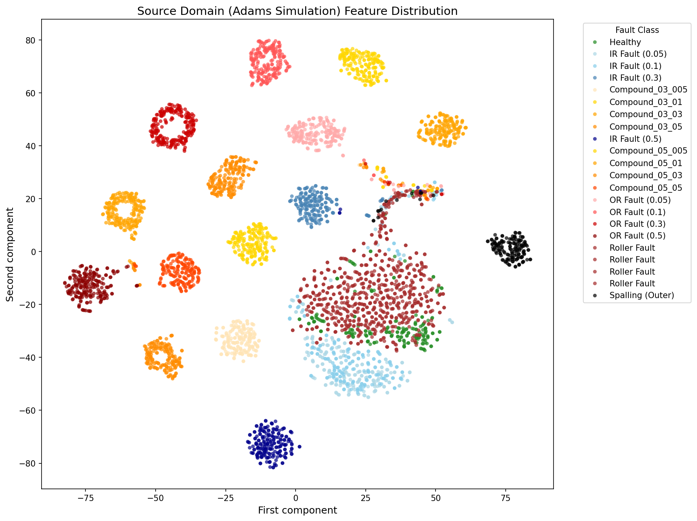

# Feedforward neural network (FFNN)

`bearing_fault_classifier_fin.py` provides the ADAMS training, validation, and internal test workflow. `predict_rev.py` applies the saved model to external `.tab` or `.mat` files, including EXP measurements.

## Install and train

From the repository root:

```bash
python -m pip install -r ffnn/requirements.txt
python ffnn/bearing_fault_classifier_fin.py
```

Place ADAMS training files directly in `data/adams/`. The default configuration uses ADAMS and leaves `CWRU_DATA_DIR = None`; EXP is processed by the separate prediction script. Training labels come from `TYPE_RULES`, `SIZE_RULES`, and `MANUAL_LABEL_MAP` in this module.

Close each of the four diagnostic plot windows to continue training. CUDA is selected when available, otherwise the CPU is used. Default paths resolve relative to the scripts, including when they are launched from another working directory.

The included ADAMS example represents one class. Training a multi-class model requires the full ADAMS dataset.

## Use an existing saved model

Copy `best_model.pt`, `label_encoder.pkl`, and `config.pkl` from the same saved training run into `ffnn/outputs/`. In the original local layout these files are in `model/`. Alternatively, the training command creates them in `outputs/`.

No pretrained weights are distributed in this model folder. Keep checkpoint, encoder, and configuration together so the network dimensions and class order match.

## Predict EXP measurements

Place externally obtained EXP `.mat` files directly in `data/exp/`. No raw EXP measurements are included in the repository; a separate Zenodo release is planned. From the repository root:

```bash
python ffnn/predict_rev.py data/exp
```

A single file or a flat input folder can be supplied as the command-line argument. With no argument, the input is `predict/`. Relative argument paths follow the terminal's working directory.

Prediction uses non-overlapping 1 s windows and the FFNN envelope order-spectrum features. All feature vectors from a file are evaluated in one batch. For the reference EXP file `BPFI_05_EXP.mat`, the imported MATLAB loader selects `Data1_AI_4_AI_4_minus_Housing_Y`.

Inference retains windows without applying the training amplitude-rejection rule. The loader multiplies the selected MATLAB signal by `9.81 * 1000` and reads sampling rate from metadata.

The per-file result contains a majority-vote class and mean class probabilities. The printed top-three table and Excel report rank classes by mean probability, which can differ from majority-vote order. The report is always written to `predict/predictions.xlsx`, including when another input directory is supplied. Later runs overwrite that report.

## Training method

The full signal is mean-centered and filtered using an eighth-order Butterworth low-pass filter, with the cutoff limited relative to the sampling rate. Consecutive 45% / 10% / 45% time regions supply training, validation, and test windows. Training uses 1 s windows with a 0.25 s stride and discards windows containing a filtered value greater than 10,000.

For each window, a Hilbert envelope, mean removal, Hamming window, and FFT yield an envelope spectrum. Frequencies are divided by shaft frequency to obtain orders. The network receives 200 RMS-amplitude features from orders 0.5 to 100 in steps of 0.5, normalized by the largest feature value in each window.

The network has three 128-neuron hidden layers with ReLU and dropout 0.3, followed by a linear classifier. Training uses cross-entropy, Adam with learning rate `1e-3`, and batch size 32.

Both the random seed and NumPy seed are 42. The ReduceLROnPlateau scheduler uses factor 0.5 and patience 10. Training runs for 100 epochs, then loads the best validation-loss checkpoint for the final ADAMS test evaluation.

## Outputs

`outputs/` contains `best_model.pt`, `label_encoder.pkl`, `config.pkl`, and `training_curves.png`, `confusion_matrix.png`, `confusion_matrix_by_type.png`, and applicable `confusion_matrix_zoomed_<type>.png` files. Test metrics and a classification report are printed in the terminal. Subsequent training runs reuse these filenames.

See [`../data/README.md`](../data/README.md) for file formats and full-dataset placement.

## ADAMS feature t-SNE

```bash
python ffnn/visualize_tsne.py
```

This script combines the retained training, validation, and test envelope order-spectrum features for visualization. It uses input features directly and requires no trained checkpoint. Perplexity is 30, learning rate is 200, iterations are 1,000, random state is 42, and initialization is PCA.

The generated figure is saved to `ffnn/outputs/tsne_adams_full.png`. The reference image below represents the full ADAMS dataset; the included single-file example does not reproduce its multi-class distribution.


